# The Ultimate Quiz

# The Goal for this Project

The goal for this project is to make a short quiz for users to test their general knowledge. 

# Table of Contents

+ [UX](#ux "UX")
    + [User Goals](#user-goals "User Goals")
    + [User Stories](#user-stories "User Stories")
    + [Requirements](#requirements)
    + [Design Choices](#design-choices)
        + [Fonts](#fonts)
        + [Icons](#icons)
        + [Colours](#colours)
        + [Structure](#structure)
        + [Responsive Displays](#responsive-displays)
        + [Wireframes](#wireframes)
    + [Features](#features)
        + [Existing Features](#existing-features)
        + [Future Features](#future-features)
    + [Technologies used](#technologies-used)
        + [Languages](#languages)
        + [Tools and Libraries](#tools-and-libraries)
    + [Testing](#testing)
        + [Unfixed Bugs](#unfixed-bugs)
    + [Deployment](#deployment)
    + [Credits](#credits)

# UX

## User Goals

+ Easy to navigate and use.
+ Provide different colour options.
+ Get the user to learn while in the quiz by providing them with the correct answers.
+ Create a quiz that is visually appealing to the user.

## User Stories

+ I want the user to feel enjoyment aswell as challanged during the quiz.
+ I want them to be able to see their result directly ingame aswell as after the
+ The user's should have an easy time to navigate through the quiz
+ With the proper feedback and a correct answer board i hope the user gets a chance to withen its general knowledge

## Requirements

+ Needs to work on any device and browser.
+ It needs to be easy on the eyes visualy
+ The copy needs to be clear and easy to read.
\
&nbsp;
[Back to Top](#table-of-contents)
\
&nbsp;

# Design Choices

## Fonts
I have used https://fonts.google.com/ to find a font thats easy to read.
I have used the "Ubuntu" for most of the site and Yellowtail for Logo

## Icons
I used https://fontawesome.com/ for my two social media icons.

## Colors
I used https://www.rapidtables.com/web/color/RGB_Color.html to find the rgb codes for the colors i wanted to use

All variable colours are as follows:

  ### Colors used

  + --white: rgb(255, 255, 255);
  + --black: rgb(0, 0, 0);
  + --purple: rgb(210, 75, 200);
  + --darkpurple: rgb(100, 30, 100);
  + --lightpurple: rgb(220, 200, 220);

\
&nbsp;

## Responsive Displays
### Phones
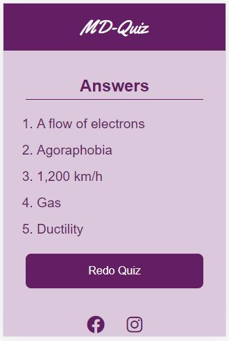
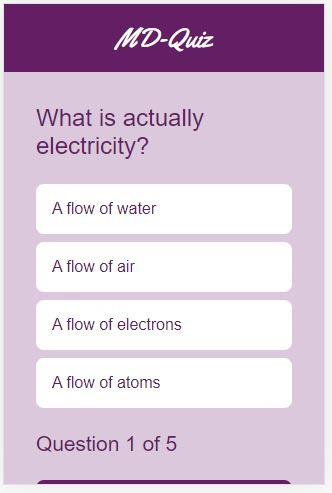
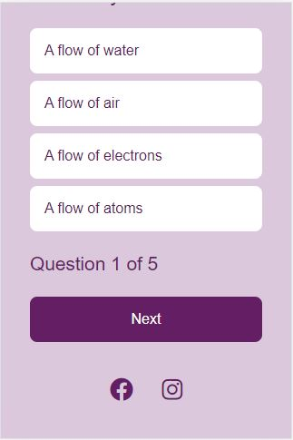
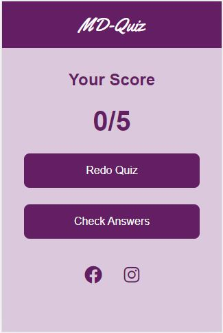
\
&nbsp;
### Tablets
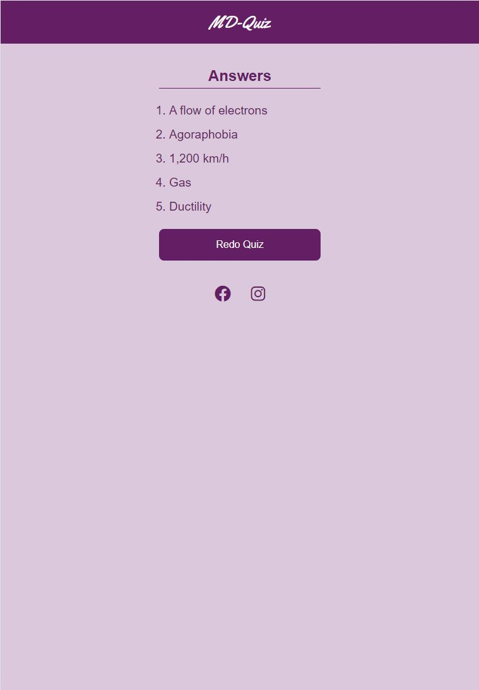
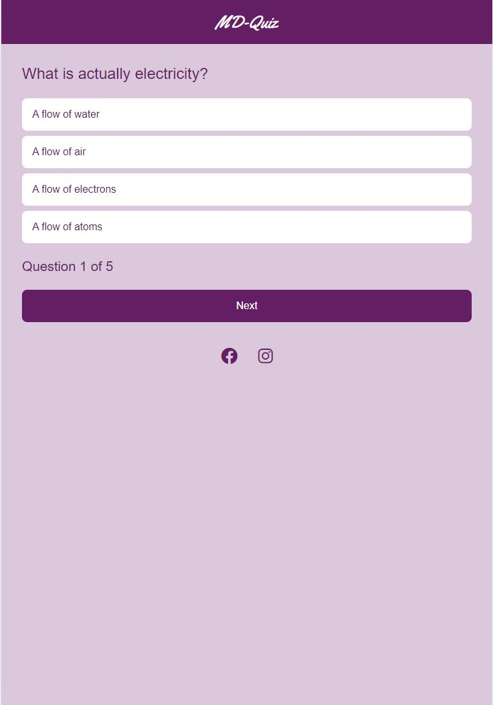
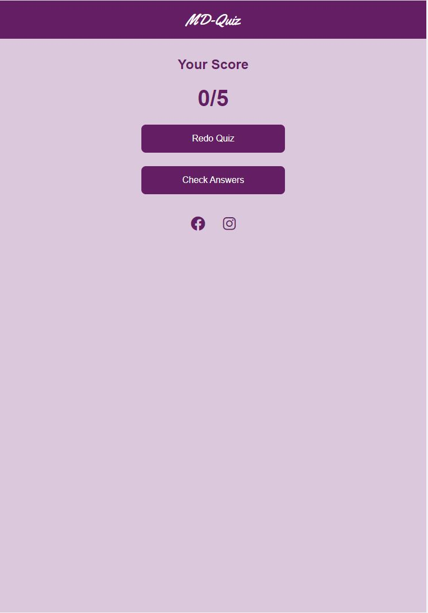
\
&nbsp;
### Desktop
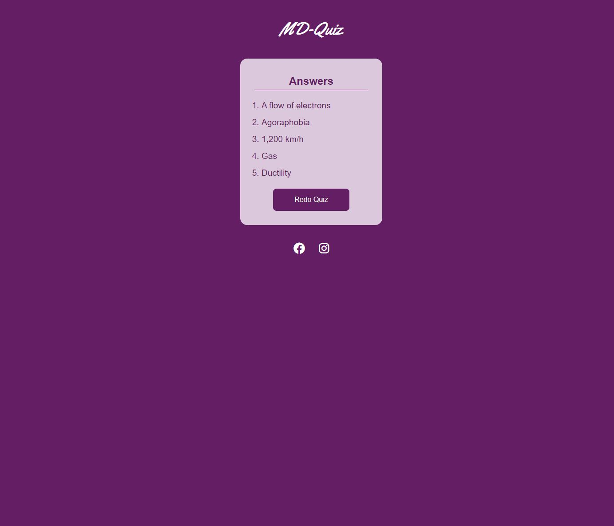
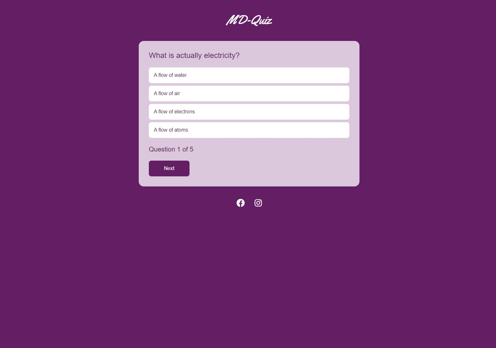
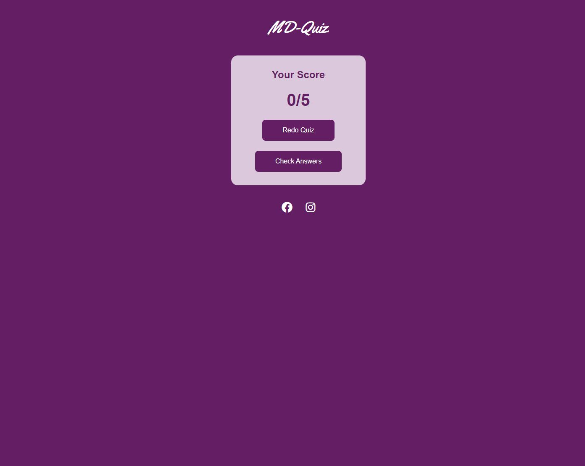

## Wireframes
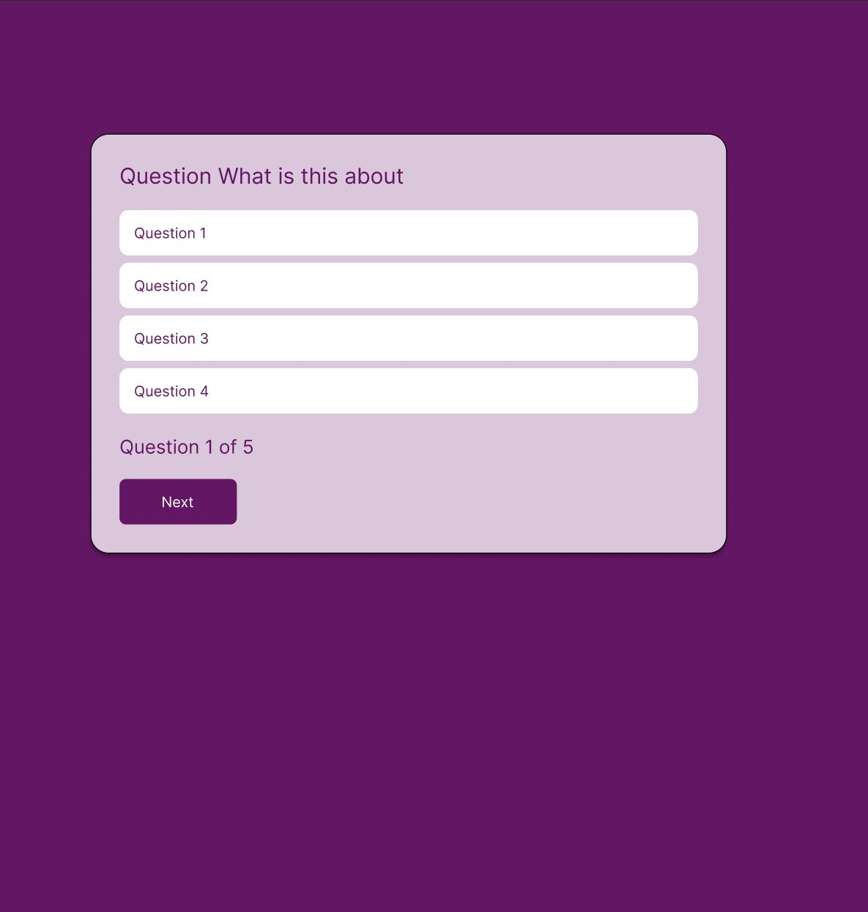
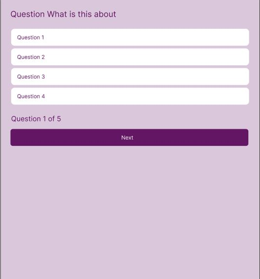

[Back to Top](#table-of-contents)
\
&nbsp;

# Features

+ Highlights the correct answer when a user selects the incorrect answer.
+ Hover effects that shows if your mouse is over a spesific button. (desktop only)
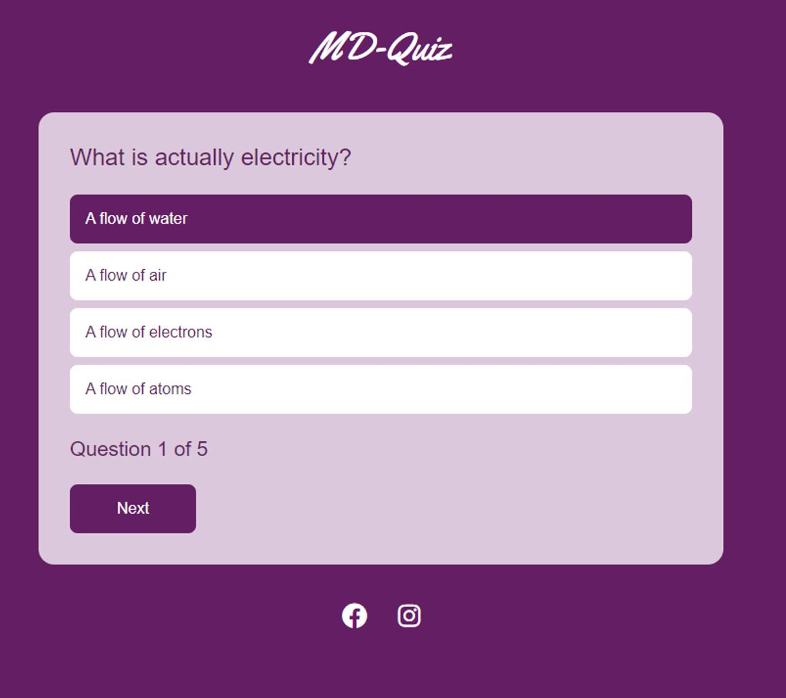

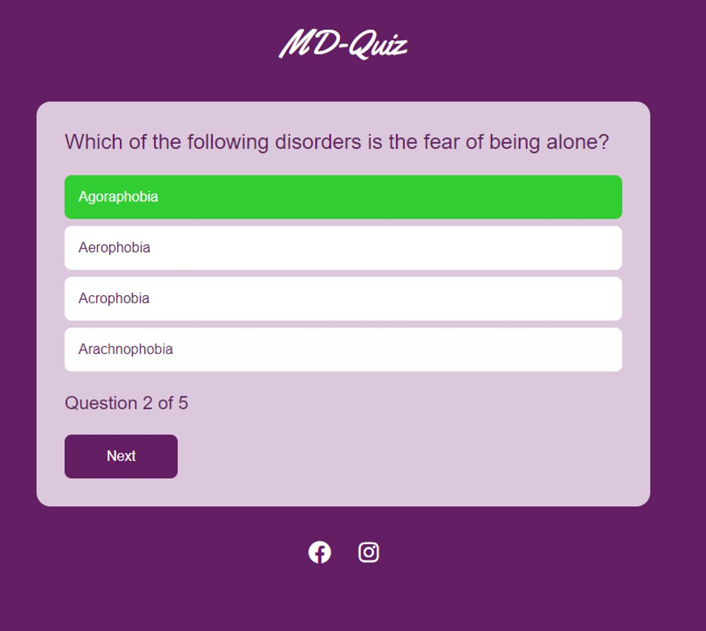
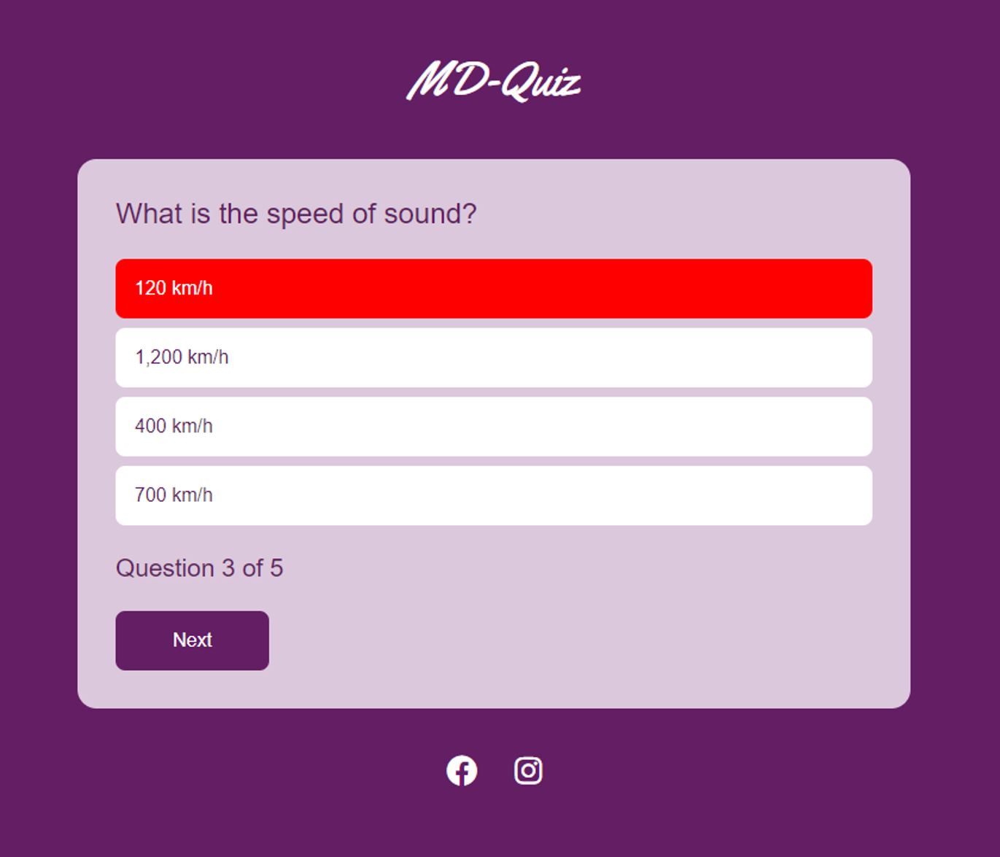
&nbsp;

## Future Features

+ More questions can be added
+ Randomize what questions will appear

[Back to Top](#table-of-contents)
\
&nbsp;

# Technologies used
## Languages

+ [HTML](https://en.wikipedia.org/wiki/HTML "HTML")
+ [CSS](https://en.wikipedia.org/wiki/CSS "CSS")
+ [JavaScript](http://en.wikipedia.org/wiki/JavaScript "JavaScript")

## Libraries & Framework

+ [Google Fonts](https://fonts.google.com/ "Google Fonts")
+ [Font Awesome library](https://fontawesome.com/ "Font Awesome")

## Tools and Libraries

+ [GitHub](https://github.com/ "GitHub")
+ [Gitpod](https://www.gitpod.io/ "Gitpod")
+ [Figma](https://figma.com/ "Figma")
+ [W3C HTML Validation Service](https://validator.w3.org/ "W3C HTML")
+ [W3C CSS Validation Service](https://jigsaw.w3.org/css-validator/ "W3C CSS")
+ [JSHint](https://jshint.com/ "JSHint")
+ [Rapidtables](https://www.rapidtables.com "rapidtables")
+ [Font Awesome library](https://fontawesome.com/ "Font Awesome")
+ [Google Fonts](https://fonts.google.com/ "Google Fonts")

\
&nbsp;
[Back to Top](#table-of-contents)
\
&nbsp;

# Testing

+ Example: There is 4 question alternatives. when alternative 2 had been clicked it would light up green or red depending on if you answered correct or not.
This effect should dissapear after 0.4 sec but its got stuck and stayed and the next questions second alternative was now lit up in green or red.
Solution: add a second getElementById and set the backgroundcolor and color to null in the setTimeOut function.

+ The purple hover effect worked fine on desktop but on mobile once a question alternative have been clicked the hover effect stoped working for that question and it was lit up permanently purple until a click command had been use anywhere on the screen.
Solution: Moved the hover effect into a media query and added (hover: hover) to see if the device used hover effects if not remove this functions.

+ I am aware of that the frequency of my commit has been lacking and i am going to make more of an effort to commit more often and have more descriptive commit texts.

### I tried these stuff in order to make point 2 the purple hover effect work without any success

+ .reset

+ .active() . blur()

+ (pointer: fine)

\
&nbsp;

## Additional Testing

### W3 HTML Validation

+ I am aware of the warning but i deemed it not an issue since it the text comes from js

### W3 CSS Validation  

### JSHint Testing

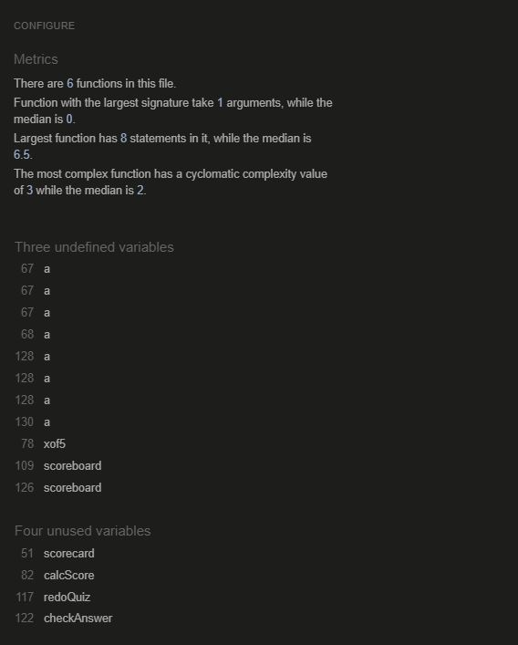

### Lighthouse Testing

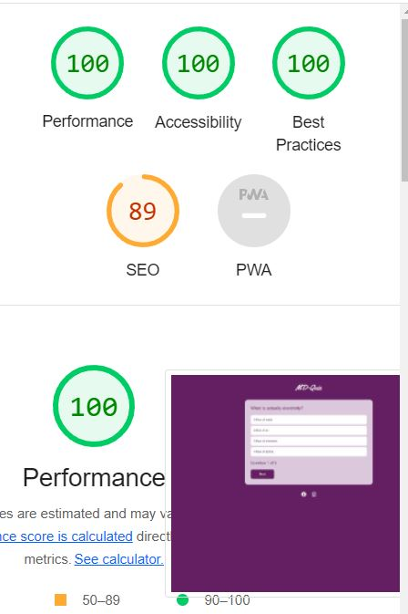
\
&nbsp;

## Deployment-----------------------

Following writing the code then committing and pushing to GitHub, this project was deployed using GitHub by the following steps.

### GitHub Pages

+ Navigate to the repository on GitHub and click 'Settings'.
+ Then select 'Pages' on the side navigation.
+ Select the 'None' dropdown, and then click 'master'.
+ Click on the 'Save' button.
+ Now the website is live on 
+ If any changes are required, they can be done, committed, and pushed to GitHub and the changes will be updated.
\
&nbsp;

\
&nbsp;
[Back to Top](#table-of-contents)
\
&nbsp;

# Credits

For code inspiration, help and advice. Thank you!

+ [Martina Terlevic](https://www.linkedin.com/in/martinaterlevic/ "Martina Terlevic") - Code Institute Mentor.
+ [DarkPuppy] - Friend / talking about potential solutions.
+ [Fabio Faria
[Daferia] (https://github.com/Daferia/ "Fabio Faria
Daferia") - README Template help.
+ [stackoverflow] https://stackoverflow.com/questions/23885255/how-to-remove-ignore-hover-css-style-on-touch-devices - For the Hover: hover function and General tips how to type code with colons and similar code.
+ [W3 Schools](https://www.w3schools.com/ "W3 Schools")
+ [welovequizzes] https://www.welovequizzes.com/multiple-choice-quiz-questions-and-answers/ -  Gave me the quiz questions

\
&nbsp;
[Back to Top](#table-of-contents)
\
&nbsp;
